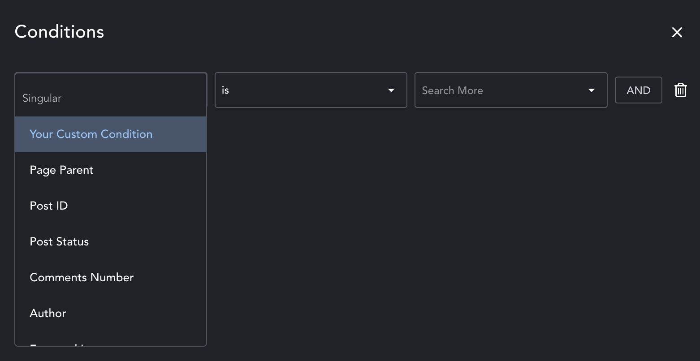
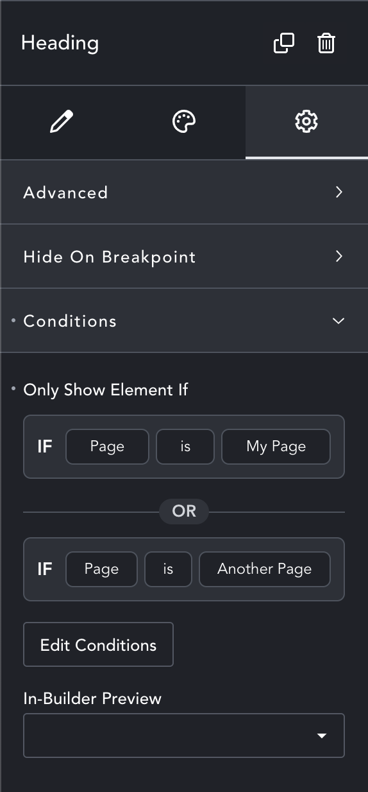
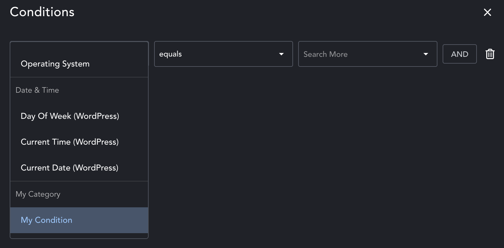
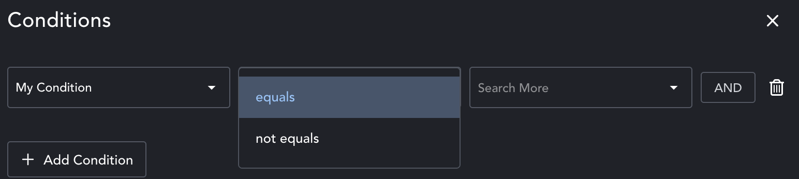

## Table Of Contents

1. [Overview](#overview)
2. [Element Display Conditions](#element-display-conditions)
3. [Query Builder Conditions](#query-builder-conditions)
4. [Templating Conditions](#templating-conditions)

## Overview

Conditions can be created using the `breakdance_register_template_types_and_conditions` action hook and the `Unicorn\ElementDisplayConditionsAPI\register` function.

## Element Display Conditions

Breakdance users can show or hide elements on the frontend of their website based on conditions.





Add an element display condition as follows:

```php
add_action(
    'breakdance_register_template_types_and_conditions',
    function() {

        \Unicorn\ConditionsAPI\register(
            [
                'supports' => ['element_display'],
                'slug' => 'unique-prefix-my-condition', // MUST BE UNIQUE
                'label' => 'My Condition',
                'category' => 'My Category',
                'operands' => ['equals', 'not equals'],

                // providing a dropdown of values is optional. if 'values' is not provided, a text input will be provided instead of a dropdown
                'values' => function() { return [
                    [
                        'label' => 'Item Group Title',
                        'items' => [
                            [
                                'text' => 'Item 1',
                                'value' => 'item-1'
                            ],
                            [
                                'text' => 'Item 2',
                                'value' => 'item-2'
                            ]
                        ]
                    ],
                    [
                        'label' => 'Item Group Title 2',
                        'items' => [
                            [
                                'text' => 'Another Item',
                                'value' => 'another-item'
                            ],
                            [
                                'text' => 'Different Item',
                                'value' => 'different-item'
                            ]
                        ]
                    ]
                ]; },

                /*
                when specifying possible values for a dropdown,
                you can optionally make the dropdown a multiselect
                */
                'allowMultiselect' => true,

                /*
                this function will be called to evaluate the condition
                if it returns true, the element will be shown
                if it returns false, the element will be hidden
                */
                'callback' => function(string $operand, $value) {

                    $myVal = 'item-1'; // usually, you'd get $myVal from somewhere, i.e. global $post; $myVal = $post->ID;

                    /*
                    if allowMultiselect is false, $value will be a string.
                    use it like so:

                    if ($operand === 'equals') {
                        return $myVal === $value;
                    }

                    if ($operand === 'not equals') {
                        return $myVal !== $value;
                    }
                    */

                    /*
                    in our example, allowMultiselect is true, which means $value will be an array of strings
                    */
                    if ($operand === 'equals') {
                        return in_array($myVal, $value);
                    }

                    if ($operand === 'not equals') {
                        return !in_array($myVal, $value);
                    }

                    return false;
                },
            ]
        );

    }
);
```

The above code will produce the following:





## Query Builder Conditions

A public API for query builder conditions is planned for the future.

## Templating Conditions

A public API for templating conditions is planned for the future.
